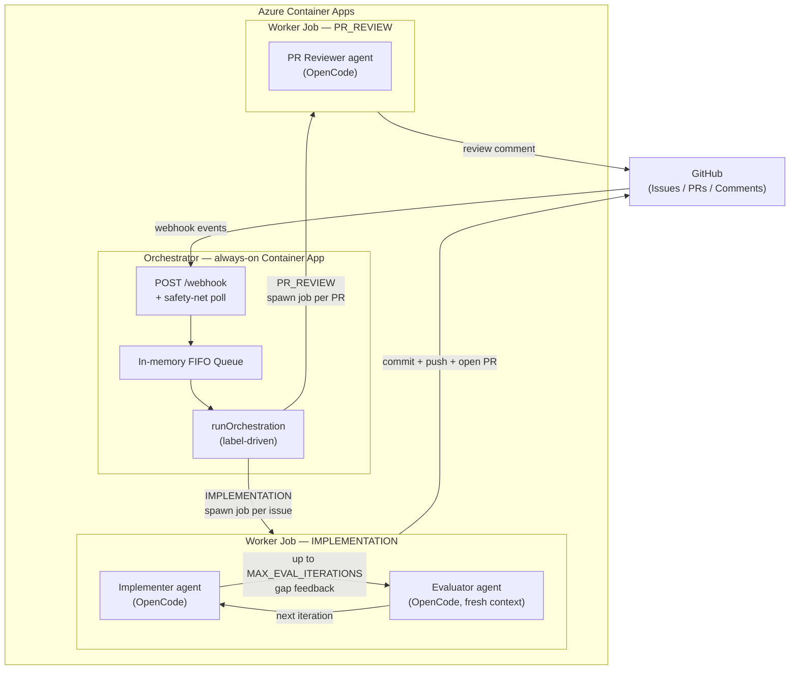

# Autoworker

Watches GitHub issues across one or more repos and, when an issue contains `@worker`, claims it and runs an ephemeral AI worker container (OpenCode CLI with harness) that implements the issue, opens a PR, and automatically reviews it — posting the review as a comment on the PR.

It can run in two modes: a polling loop (`poll`) or an always-on, event-driven service (`serve`) that reacts to GitHub webhooks while keeping a safety-net poll.

Supported runners:

- `JOB_RUNNER=local-docker` (default): runs the worker containers locally from main Node.js server via Docker
- `JOB_RUNNER=aca`: creates + starts remote per-issue Azure Container Apps Jobs from main Node.js server

## Architecture



## Worker container agents

Each worker is an ephemeral container (an Azure Container Apps Job or a local Docker container) that runs one or two OpenCode CLI sessions. OpenCode receives a minimal set of env vars — no GitHub credentials — so only the surrounding harness can perform GitHub operations.

**IMPLEMENTATION mode** (triggered when an issue mentions `@worker`): the implementer agent clones the repo and edits code to address the issue. An evaluator agent then opens a fresh context, reads the resulting `git diff`, and checks it against the `## Acceptance Criteria` section in the issue body (if present). If the diff falls short, the evaluator feeds a gap list back to the implementer for another iteration; this cycle repeats up to `MAX_EVAL_ITERATIONS` times (default 2). Once the evaluator is satisfied (or the limit is reached), the harness commits, pushes, opens a PR, and posts the PR link as a comment on the issue.

**PR_REVIEW mode** (triggered when a PR needs review): a single PR reviewer agent reads the PR diff and posts a structured review comment. No iteration is needed.

Including a `## Acceptance Criteria` section in an issue body activates the evaluator loop and gives the implementer measurable goals to converge on.

## Workflow

1. Find open issues that mention `WORKER_MENTION` (default `@worker`) with no state label
2. Skip anything already labeled `in-progress` / `pr-created` / `in-review` / `pr-reviewed`
3. Add `in-progress` label to claim the issue
4. If `DRY_RUN=false`, start the worker container/job
5. Worker runs OpenCode to edit files; then the worker harness deterministically commits/pushes/creates PR and comments the PR link back to the issue

Security note: OpenCode runs without GitHub token env vars (and with a minimal allowlist of env vars); only the harness performs GitHub operations.

## Local run (poller)

```bash
pnpm install
pnpm build
cp .env.example .env
pnpm start
```

Background helper (PID + logs in `.run/`):

```bash
./poller.sh start
./poller.sh logs
./poller.sh stop
```

## Worker image (OpenCode)

```bash
DOCKER_CONFIG=/tmp/codex-docker-config docker build -t autoworker-worker:local -f docker/worker.Dockerfile .
```

## Webhook mode (`serve`)

Run as a long-lived process:

```bash
GITHUB_WEBHOOK_SECRET=... pnpm build && node dist/cli.js serve
```

- Exposes `POST /webhook` on `HEALTH_PORT`, verified via `X-Hub-Signature-256` HMAC against `GITHUB_WEBHOOK_SECRET`.
- Reacts to `issues`, `issue_comment`, `pull_request`, `pull_request_review`, and `pull_request_review_comment` events; queues per-repo in an in-memory FIFO and returns `202` immediately.
- A consumer drains the queue and runs normal orchestration (idempotent, label-driven).
- Keeps a **safety-net poll** (`POLL_INTERVAL_SECONDS`) — the consumer and poll share a lock and never run concurrently.

**Single replica only** — the queue is process-local.

For webhook secret setup and GitHub settings, see [docs/webhook.md](docs/webhook.md).

### Scheduling / active window

Webhooks process 24/7. The safety-net poll runs every `POLL_INTERVAL_SECONDS` (default 900s) within a configurable work-hours window (`WORK_HOURS_START`–`WORK_HOURS_END`, default **07:00–21:00** `WORK_HOURS_TZ`, default `Europe/Prague`). Set `WORK_HOURS_START == WORK_HOURS_END` to disable the window.

## Env vars

Minimum (local):

- `REPOS` — JSON array of repos with per-repo step flags (see "Repo configuration" below)
- `GITHUB_TOKEN` (or `GH_TOKEN`)
- `DRY_RUN` (`true` = claim-only, `false` = also runs the worker)

### Repo configuration

`REPOS` is a JSON array. Each entry has:

- `provider`: `"github"` (only one wired up today) or `"gitlab"` (parsed but skipped at runtime until a GitLab service is implemented).
- `slug`: `"owner/repo"`.
- `steps` (optional): subset of `["impl","review","merge"]`. Defaults to `["impl","review"]` when omitted — `merge` (auto-merge of approved PRs) must be opted in per repo.

Example — enable auto-merge only for one repo:

```json
[
  {"provider":"github","slug":"etnetera/waulter"},
  {"provider":"github","slug":"beranradek/sum","steps":["impl","review","merge"]}
]
```

Single repo, defaults:

```json
[{"provider":"github","slug":"owner/repo"}]
```

**Deprecated fallback (still works):** if `REPOS` is unset but `GITHUB_REPOS` is set (comma/whitespace-separated `owner/repo` list), repos are assumed to be GitHub and the global `STEP_IMPLEMENTATION` / `STEP_PR_REVIEW` / `STEP_PR_MERGE` env vars determine which steps run for every repo. A deprecation warning is logged on each cycle.

When `DRY_RUN=false`:

- `WORKER_IMAGE` (e.g. `autoworker-worker:local`)
- One LLM credential — `OPENAI_API_KEY`, `ANTHROPIC_API_KEY` (API key only; monthly subscription not supported), or `AZURE_API_KEY` + `AZURE_RESOURCE_NAME` (the `LLM_MODEL` prefix selects the provider)
- `LLM_MODEL` (optional, default `openai/gpt-5-mini`)

Optional:

- `GITHUB_WEBHOOK_SECRET` (required for `serve`/webhook mode — see "Webhook mode")
- `POLL_INTERVAL_SECONDS` (default `900`; in `serve` mode this is the safety-net poll interval)
- `MAX_ACCEPT_PER_RUN` (default `1`)
- `MAX_CONCURRENT_WORKERS` (default `5`)
- `JOB_RUNNER` (`local-docker` or `aca`)
- `LABEL_FAILED` (default `worker-failed`)
- `HEALTH_HOST` (default `0.0.0.0`)
- `HEALTH_PORT` (default `8080`) — see [docs/health-endpoints.md](docs/health-endpoints.md) for the `/healthz`/`/readyz` status payload
- `WORK_HOURS_START` (default `7`) — applies to the **safety-net poll only**, not webhooks
- `WORK_HOURS_END` (default `21`) — set equal to `WORK_HOURS_START` to run the poll 24/7 too
- `WORK_HOURS_TZ` (default `Europe/Prague`)

Azure runner (`JOB_RUNNER=aca`) additionally requires:

- `AZURE_SUBSCRIPTION_ID`, `AZURE_RESOURCE_GROUP`, `AZURE_LOCATION`, `ACA_ENV_NAME`
- Auth: either `AZURE_USE_MANAGED_IDENTITY=true` or service principal (`AZURE_TENANT_ID`, `AZURE_CLIENT_ID`, `AZURE_CLIENT_SECRET`)

## Azure setup (Terraform)

See [docs/azure-setup.md](docs/azure-setup.md) for full setup, post-deploy secrets, and `az` commands. Minimum variables:

```bash
export TF_VAR_subscription_id="<your-subscription-id>"
export TF_VAR_resource_group_name="autoworker-rg"
export TF_VAR_location="germanywestcentral"
export TF_VAR_github_repos="myorg/myrepo"
terraform apply
```
